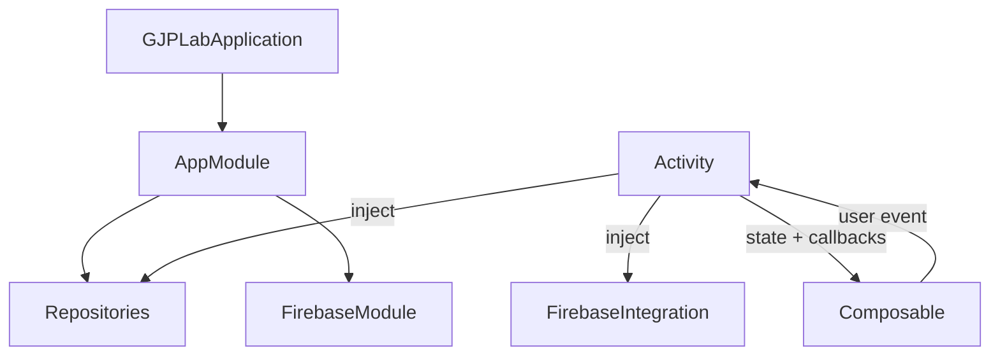

# Application architecture

Status: Implemented snapshot, 2026-10-04

## Purpose

GJPLab is a single-module Android learning application. It favors small, readable feature slices over production-scale abstraction: Activities provide navigation and state ownership, Jetpack Compose renders screens, Koin provides application-scoped dependencies, and external SDK access is kept outside composables.

## Runtime flow


[`SplashActivity`](../../app/src/main/java/com/ganjianping/lab/ak/shell/startup/SplashActivity.kt) is the exported launcher. Feature Activities and [`MainActivity`](../../app/src/main/java/com/ganjianping/lab/ak/shell/MainActivity.kt) are internal components. The Firebase messaging service is internal and is invoked through the Firebase messaging intent action.

## Code organization

| Path | Responsibility |
| --- | --- |
| `shell/` | `GJPLabApplication`, `MainActivity` (dashboard or maintenance), and the Koin `AppModule` |
| `shell/startup/` | `SplashActivity`, `SplashScreen`, and `MaintenanceScreen` |
| `shell/navigation/` | `NavigationMenu` (every category and topic), `FeatureRoute`, the dashboard (`CategorySidebar`), and the catalogue (`FeatureCatalogActivity`, `FeatureCatalogScreen`) |
| `features/<category>/<feature>/` | One flat folder per feature: Activities, Compose screens, repositories, and models |
| `features/integration/firebase/` | All Firebase code: lab screen, `FirebaseIntegration`, constants, Koin module, and messaging service. Startup depends on it, so unlike other features it cannot be removed on its own |
| `common/config/` | Stable application behavior constants |
| `common/network/` | Reusable Android connectivity checks |
| `common/theme/` | Slate Material 3 color, typography, and `GJPLabTheme` |

Paths are relative to the package root `app/src/main/java/com/ganjianping/lab/ak/`. The layout and type names mirror the iOS lab, with `shell/` in place of iOS `app/` ([decision 0001](../decisions/0001-folder-structure-mirrors-ios.md)). Folder names are lowercase and do not repeat their parent (`httpclient/httpurlconnection`). New code should follow the nearest established feature. Reusable app code belongs in `common/`; SDK-specific behavior belongs in `features/integration/<sdk>/` ([decision 0002](../decisions/0002-sdk-code-in-integration-features.md)).

### Adding a feature

1. Write `doc/specs/features/<category>/<feature>/<feature>_requirement.md` from the [requirement template](../templates/requirement.md); add `<feature>_detail_design.md` beside it from the [detail design template](../templates/detail_design.md).
2. Add the Activity and screen under `features/<category>/<feature>/`, and declare the Activity (non-exported) in `AndroidManifest.xml`.
3. Add a `FeatureRoute` case and map it to the Activity in `FeatureCatalogActivity.openFeature`.
4. In `shell/navigation/NavigationMenu.kt`, add the topic with `route = FeatureRoute.<Case>`, or give an existing planned topic the route. `NavigationMenuTest` fails if a route is missing or listed twice.
5. Host `CallBlockingHost` at the Activity's Compose root and start/stop monitoring in `onResume`/`onPause`, like the existing feature Activities.
6. Register any repository in `shell/AppModule.kt`, and add light and dark previews for each screen.

## Dependency and event flow



- [`GJPLabApplication`](../../app/src/main/java/com/ganjianping/lab/ak/shell/GJPLabApplication.kt) starts Koin and initializes Firebase once per application process.
- Activities own navigation, runtime-permission launchers, and current screen state.
- Composables receive state and event callbacks. They do not construct repositories, start activities, or call Firebase directly.
- [`AppModule`](../../app/src/main/java/com/ganjianping/lab/ak/shell/AppModule.kt) composes application dependencies, including the Firebase module.

## State and lifecycle model

The project intentionally uses Activity fields and Compose `mutableStateOf` rather than ViewModels. This is appropriate for the current lab size but has consequences:

- Activity recreation resets transient fields unless they are reconstructed from the Intent or another source.
- Long-running operations are owned by an Activity lifecycle or by an SDK callback.
- Navigation is implemented with explicit Intents rather than a navigation graph.
- Dashboard and catalogue content (categories, topics, and each topic's `FeatureRoute`) lives only in [`NavigationMenu`](../../app/src/main/java/com/ganjianping/lab/ak/shell/navigation/NavigationMenu.kt). A topic without a route is shown as planned; `NavigationMenuTest` fails if a route is missing or listed twice.
- The dashboard passes the category `id` to the catalogue Activity; the catalogue renders that category's topics and opens implemented features with explicit Intents.
- Process-death restoration and multi-screen shared state are not general project guarantees.

Do not introduce a ViewModel, navigation framework, domain layer, or module split as an incidental refactor. Introduce one only when a feature requirement demonstrates the need and include migration tests.

## Platform and security boundaries

The manifest currently declares Internet, network-state, notification, and phone-state permissions. Runtime notification permission is handled by the Firebase feature Activity on Android 13 and newer; `READ_PHONE_STATE` is requested only after the user enables Block App During Calls. Network traffic is constrained by [`network_security_config.xml`](../../app/src/main/res/xml/network_security_config.xml).

Keep protected API checks and permission requests in Activities or dedicated platform adapters. Keep credentials and server authority outside the mobile application. Firebase client configuration is not a server credential, but service-account files, server keys, OAuth secrets, and App Check debug tokens must never be committed.

## Build and verification

The app uses one `app` module, a version catalog, Compose Material 3, Koin, and the Firebase Android BoM. The supported application range is API 30 through target SDK 37.

Use the smallest relevant checks first:

```bash
./gradlew test
./gradlew assembleDebug
./gradlew connectedDebugAndroidTest
```

The connected test requires an emulator or device. Current checked-in tests are starter coverage only; feature work should add deterministic tests at the lowest layer that proves the behavior.

## Known architectural constraints

| Constraint | Consequence | Revisit when |
| --- | --- | --- |
| Single app module | Simple discovery; weak compile-time feature boundaries | Build time or ownership becomes a problem |
| Activity-owned state | Low ceremony; limited recreation guarantees | State must survive recreation or be shared |
| Explicit-Intent navigation ([decision 0003](../decisions/0003-activity-navigation.md)) | Clear small-app flow; contracts are string/class based; no side-by-side tablet panes | Routes, deep links, or back-stack behavior grow |
| SDK callbacks in integration layer | Small API surface; cancellation and rich errors are limited | Callers need structured concurrency or failure types |
| Minimal automated tests | Fast experimentation; regression confidence is low | Any behavior becomes important to preserve |

Feature-specific behavior belongs in the linked documents rather than this overview:

- [Slate design system](../specs/common/theme/theme_detail_design.md)
- [Splash detailed design](../specs/shell/startup/splash_detail_design.md)
- [Block App During Calls detailed design](../specs/features/security/blockappduringcalls/blockappduringcalls_detail_design.md)
- [Maintenance detailed design](../specs/shell/startup/maintenance_detail_design.md)
- [Dashboard detailed design](../specs/shell/navigation/sidebar_detail_design.md) and [catalogue detailed design](../specs/shell/navigation/catalog_detail_design.md)
- [HttpURLConnection detailed design](../specs/features/httpclient/httpurlconnection/httpurlconnection_detail_design.md)
- [OS & hardware detailed design](../specs/features/others/deviceinfo/deviceinfo_detail_design.md)
- [Firebase detailed design](../specs/features/integration/firebase/firebase_detail_design.md)
