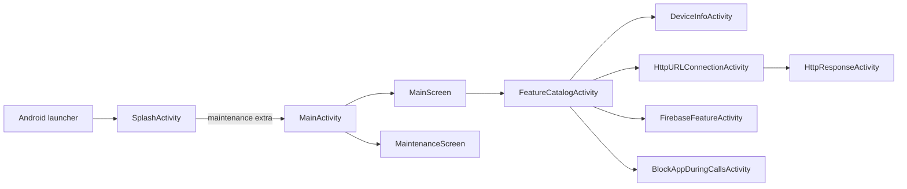
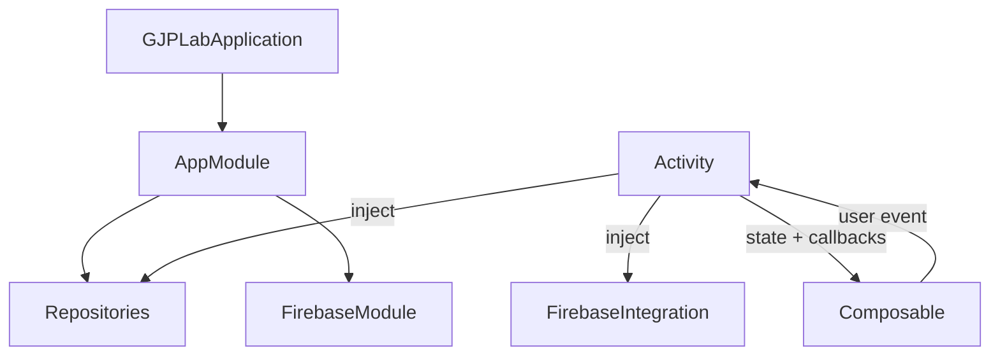

# Application architecture

Status: Implemented snapshot, 2026-08-30

## Purpose

GJPLab is a single-module Android learning application. It favors small, readable feature slices over production-scale abstraction: Activities provide navigation and state ownership, Jetpack Compose renders screens, Koin provides application-scoped dependencies, and external SDK access is kept outside composables.

## Runtime flow



[`SplashActivity`](../../app/src/main/java/com/ganjianping/lab/ak/SplashActivity.kt) is the exported launcher. Feature Activities and [`MainActivity`](../../app/src/main/java/com/ganjianping/lab/ak/MainActivity.kt) are internal components. The Firebase messaging service is internal and is invoked through the Firebase messaging intent action.

## Code organization

| Path | Responsibility |
| --- | --- |
| `common/config/` | Stable application behavior constants |
| `common/network/` | Reusable Android connectivity checks |
| `common/theme/` | Material 3 color, typography, and app theme |
| `di/` | Application dependency graph |
| `features/<feature>/` | Feature Activity, Compose screen, and feature-specific data code |
| `features/catalog/` | Category catalogue Activity and its feature-list screen |
| `integration/firebase/` | Firebase SDK construction, constants, operations, and messaging service |
| Root package Activities/screens | Startup, dashboard, and maintenance flows shared by the application |

New code should follow the nearest established feature unless the task explicitly changes the architecture. Reusable app code belongs in `common/`; SDK-specific behavior belongs in its integration package.

## Dependency and event flow



- [`GJPLabApplication`](../../app/src/main/java/com/ganjianping/lab/ak/GJPLabApplication.kt) starts Koin and initializes Firebase once per application process.
- Activities own navigation, runtime-permission launchers, and current screen state.
- Composables receive state and event callbacks. They do not construct repositories, start activities, or call Firebase directly.
- [`AppModule`](../../app/src/main/java/com/ganjianping/lab/ak/di/AppModule.kt) composes application dependencies, including the Firebase module.

## State and lifecycle model

The project intentionally uses Activity fields and Compose `mutableStateOf` rather than ViewModels. This is appropriate for the current lab size but has consequences:

- Activity recreation resets transient fields unless they are reconstructed from the Intent or another source.
- Long-running operations are owned by an Activity lifecycle or by an SDK callback.
- Navigation is implemented with explicit Intents rather than a navigation graph.
- The dashboard passes a `DashboardCategory` name to the catalogue Activity; the catalogue owns only the category-list UI and delegates implemented feature launches to explicit Intents.
- Process-death restoration and multi-screen shared state are not general project guarantees.

Do not introduce a ViewModel, navigation framework, domain layer, or module split as an incidental refactor. Introduce one only when a feature requirement demonstrates the need and include migration tests.

## Platform and security boundaries

The manifest currently declares Internet, network-state, notification, and phone-state permissions. Runtime notification permission is handled by the Firebase feature Activity on Android 13 and newer; `READ_PHONE_STATE` is requested only after the user enables Block App During Calls. Network traffic is constrained by [`network_security_config.xml`](../../app/src/main/res/xml/network_security_config.xml).

Keep protected API checks and permission requests in Activities or dedicated platform adapters. Keep credentials and server authority outside the mobile application. Firebase client configuration is not a server credential, but service-account files, server keys, OAuth secrets, and App Check debug tokens must never be committed.

## Build and verification

The app uses one `app` module, a version catalog, Compose Material 3, Koin, and the Firebase Android BoM. The supported application range is API 30 through target SDK 37.

Use the smallest relevant checks first:

```bash
./gradlew test
./gradlew assembleDebug
./gradlew connectedDebugAndroidTest
```

The connected test requires an emulator or device. Current checked-in tests are starter coverage only; feature work should add deterministic tests at the lowest layer that proves the behavior.

## Known architectural constraints

| Constraint | Consequence | Revisit when |
| --- | --- | --- |
| Single app module | Simple discovery; weak compile-time feature boundaries | Build time or ownership becomes a problem |
| Activity-owned state | Low ceremony; limited recreation guarantees | State must survive recreation or be shared |
| Explicit-Intent navigation | Clear small-app flow; contracts are string/class based | Routes, deep links, or back-stack behavior grow |
| SDK callbacks in integration layer | Small API surface; cancellation and rich errors are limited | Callers need structured concurrency or failure types |
| Minimal automated tests | Fast experimentation; regression confidence is low | Any behavior becomes important to preserve |

Feature-specific behavior belongs in the linked documents rather than this overview:

- [Slate design system](design-system.md)
- [Splash detailed design](../detail-design/splash-screen.md)
- [Block App During Calls detailed design](../detail-design/security/block_app_during_calls.md)
- [Firebase integration](../integrations/firebase.md)
