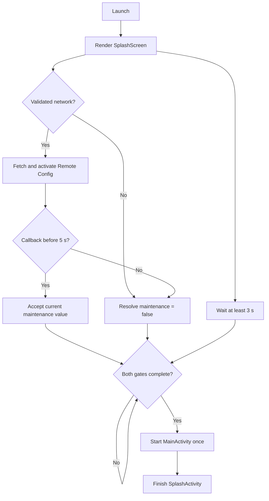

# Splash Screen detailed design

Status: Partial implementation

Requirements: [Splash screen requirements](../requirements/splash-screen.md)

## Current design

[`SplashActivity`](../../app/src/main/java/com/ganjianping/lab/ak/SplashActivity.kt) is the launcher and owns startup coordination. It renders the stateless [`SplashScreen`](../../app/src/main/java/com/ganjianping/lab/ak/SplashScreen.kt), checks validated connectivity, starts Remote Config when online, waits for the configured minimum duration, and opens [`MainActivity`](../../app/src/main/java/com/ganjianping/lab/ak/MainActivity.kt) with a maintenance Boolean.



## Source map

| Source | Responsibility |
| --- | --- |
| [`SplashActivity.kt`](../../app/src/main/java/com/ganjianping/lab/ak/SplashActivity.kt) | Startup timers, connectivity, Remote Config callback, race guards, and navigation |
| [`SplashScreen.kt`](../../app/src/main/java/com/ganjianping/lab/ak/SplashScreen.kt) | Brand presentation only |
| [`AppConfig.kt`](../../app/src/main/java/com/ganjianping/lab/ak/common/config/AppConfig.kt) | 3-second minimum and 5-second timeout |
| [`NetworkConnectivity.kt`](../../app/src/main/java/com/ganjianping/lab/ak/common/network/NetworkConnectivity.kt) | Requires Android `INTERNET` and `VALIDATED` capabilities |
| [`FirebaseIntegration.kt`](../../app/src/main/java/com/ganjianping/lab/ak/integration/firebase/FirebaseIntegration.kt) | Fetches/activates Remote Config and returns the current maintenance value |
| [`MainActivity.kt`](../../app/src/main/java/com/ganjianping/lab/ak/MainActivity.kt) | Selects dashboard or maintenance and owns maintenance retry |
| [`AndroidManifest.xml`](../../app/src/main/AndroidManifest.xml) | Declares network permissions and the launcher Activity |

## Coordination model

`SplashActivity` uses these transient fields:

| Field | Role |
| --- | --- |
| `remoteConfigLoaded` | First-result-wins guard for callback, offline fallback, and timeout |
| `minimumSplashTimeElapsed` | Minimum-duration gate |
| `maintenanceEnabled` | Accepted value passed to `MainActivity` |
| `hasOpenedMainActivity` | Exactly-once navigation guard |
| `remoteConfigTimeoutJob` | Five-second Activity-owned timeout |

Navigation occurs when:

```text
remoteConfigLoaded && minimumSplashTimeElapsed && !hasOpenedMainActivity
```

The minimum timer and timeout run in `lifecycleScope`. Destroying the Activity cancels those jobs. Cancelling the timeout does not cancel Firebase's task; a late callback is ignored by `remoteConfigLoaded`.

## Remote Config semantics

`FirebaseIntegration.fetchMaintenanceMode` invokes `fetchAndActivate()` and returns the current Boolean when the task completes. It does not expose `task.isSuccessful`. Therefore a callback can represent a newly fetched value, a previously activated value, or the local default (`false`). The Activity adds a separate timeout but cannot cancel the Firebase operation.

This behavior satisfies the simple lab fallback but does not fully express the requirement distinction between success, cached value, and failure. Change the integration result type before adding policy that depends on those outcomes.

## Handoff and retry

`SplashActivity` passes `MainActivity.EXTRA_MAINTENANCE_ENABLED`, starts `MainActivity`, and calls `finish()`. `MainActivity` defaults a missing extra to `false`. When maintenance is shown, retry fetches Remote Config and updates Activity-owned Compose state; it does not recreate the splash.

## Requirement status

| Requirement area | Status | Evidence or gap |
| --- | --- | --- |
| Cold-launch Activity and exactly-once navigation | Implemented | Launcher manifest entry, completion guard, navigation guard, and `finish()` |
| 3-second minimum and 5-second timeout | Implemented | Values in `AppConfig`; timers in `SplashActivity` |
| Validated-network precheck and offline fallback | Implemented | `NetworkConnectivity` plus `ACCESS_NETWORK_STATE` |
| First terminal result wins | Implemented within one Activity instance | `remoteConfigLoaded` rejects late callbacks |
| Maintenance destination and retry | Implemented | Intent extra and `MainActivity.loadRemoteConfig()` |
| Visible progress state | Planned | Current screen shows only the brand mark and title |
| Material light/dark adaptation | Implemented | Splash uses semantic background, primary, and paired content roles from `GJPLabTheme` |
| Correct light/dark previews | Implemented | Separate previews use day and night configurations |
| Accessibility semantics and text scaling | Partial | Text scales with `sp`, but progress semantics and dedicated accessibility tests remain absent |
| Reduced-motion behavior | Planned | No animation currently exists; requirement applies if animation is added |
| Deterministic startup tests | Planned | Coordination remains coupled to Activity, Firebase callback, and real time |
| Recreation continuity | Open | Activity recreation restarts timers and fetch; product requirement is undecided |

## Test strategy

The highest-value seam is a plain Kotlin startup coordinator with injected clock/timer and maintenance loader. It would make gate ordering, timeout, cancellation, and first-result-wins behavior deterministic without requiring a device. Do not extract it solely for style; extract it when implementing regression coverage or recreation behavior.

Recommended coverage:

- JVM: every row in the decision table, both gate orders, callback/timeout races, and exactly-once output.
- Compose: brand/progress semantics, light/dark colors, enlarged text, and reduced motion if animation exists.
- Instrumented: launcher destination handoff, Back behavior, Activity recreation policy, and validated platform integration.
- Manual: offline device, captive or unvalidated network, delayed Firebase response, and previews.

## Verification

```bash
./gradlew testDebugUnitTest
./gradlew assembleDebug
./gradlew connectedDebugAndroidTest
```

The connected check is conditional on an available emulator or device. Tests must not depend exclusively on live Firebase state.

## Change checklist

When changing startup behavior:

- update requirement IDs and the decision table first when product behavior changes;
- preserve exactly-once completion and navigation under callback/timeout races;
- verify Back, warm resume, and the agreed recreation policy;
- keep platform, Firebase, and navigation work out of `SplashScreen`;
- update this status matrix and document any remaining gap.
