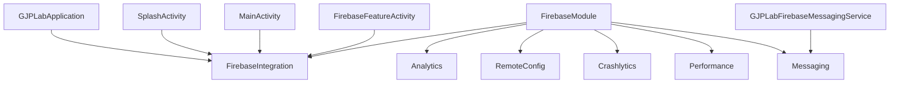

# Firebase integration

Status: Implemented lab integration

## Scope

GJPLab connects application ID `com.ganjianping.lab.ak` to Firebase Analytics, Remote Config, Crashlytics, Performance Monitoring, and Cloud Messaging. The integration is intentionally small and demonstrative; it is not a production security or observability blueprint.

## Architecture



[`FirebaseModule`](../../app/src/main/java/com/ganjianping/lab/ak/features/integration/firebase/FirebaseModule.kt) registers SDK instances and [`FirebaseIntegration`](../../app/src/main/java/com/ganjianping/lab/ak/features/integration/firebase/FirebaseIntegration.kt) as Koin singletons. [`GJPLabApplication`](../../app/src/main/java/com/ganjianping/lab/ak/shell/GJPLabApplication.kt) starts Koin, then calls `FirebaseIntegration.initialize()` once for the application process.

## Build configuration

| Concern | Source of truth |
| --- | --- |
| Firebase project/client configuration | [`app/google-services.json`](../../app/google-services.json) |
| SDK and plugin versions | [`gradle/libs.versions.toml`](../../gradle/libs.versions.toml) |
| App plugins and dependencies | [`app/build.gradle.kts`](../../app/build.gradle.kts) |
| Project-level plugin declarations | [`build.gradle.kts`](../../build.gradle.kts) |
| Manifest service and permissions | [`AndroidManifest.xml`](../../app/src/main/AndroidManifest.xml) |

The app imports the Firebase Android BoM and therefore does not assign individual SDK versions. The Google Services plugin processes `google-services.json`; Crashlytics and Performance use their respective Gradle plugins.

Do not copy version numbers into this guide. Read the version catalog when exact current versions matter.

## Stable contracts

[`FirebaseConstants`](../../app/src/main/java/com/ganjianping/lab/ak/features/integration/firebase/FirebaseConstants.kt) owns names that must remain stable across code and Firebase configuration:

| Service | Contract |
| --- | --- |
| Analytics | `app_started`, `firebase_feature_opened` |
| Crashlytics | `app_version`, `firebase_demo` |
| Remote Config | `gjp_lab_maintenance_enabled` |
| Performance | `firebase_demo_trace` |
| Messaging | topic `gjp_lab_demo`; channel `gjp_lab_firebase_messages` |

Renaming one of these values is an integration change. Coordinate dashboard configuration, tests, and documentation in the same change.

## Service behavior

### Analytics

Initialization logs `app_started`. Opening or using the Firebase lab logs `firebase_feature_opened`. Keep event names stable, add meaning through bounded parameters, and never include credentials or personal information.

### Remote Config

Initialization sets:

- minimum fetch interval: zero in debug, one hour in non-debug builds;
- local default: `gjp_lab_maintenance_enabled = false`.

`fetchMaintenanceMode` calls `fetchAndActivate()` and then reads the current Boolean. It does not distinguish successful fetch, activation of a previously fetched value, failed fetch with an active value, or fallback to the default. The startup flow provides its own five-second waiting limit. See [the splash detailed design](../detail-design/splash-screen.md) for the resulting state and timeout behavior.

### Crashlytics

Initialization records `BuildConfig.VERSION_NAME` under `app_version`. The Firebase feature screen can write a non-sensitive demo log, set `firebase_demo = true`, and record a non-fatal `IllegalStateException`.

Do not add passwords, access tokens, full user identifiers, message payloads, or other sensitive values to logs, keys, or exception messages. A deliberate fatal crash must remain debug-only and is not currently part of this lab.

### Performance Monitoring

The SDK and Gradle plugin enable supported automatic instrumentation. The feature screen also starts `firebase_demo_trace`, waits approximately 300 milliseconds on the main looper, stops the trace, and displays the measured elapsed time.

Keep custom trace names stable and bounded. Always stop traces on every completion path when adding real operations.

### Cloud Messaging

The integration can retrieve the current registration token and subscribe to `gjp_lab_demo`. [`GJPLabFirebaseMessagingService`](../../app/src/main/java/com/ganjianping/lab/ak/features/integration/firebase/GJPLabFirebaseMessagingService.kt) handles token refresh and foreground messages, creates the notification channel, and opens `MainActivity` from an immutable `PendingIntent`.

[`FirebaseFeatureActivity`](../../app/src/main/java/com/ganjianping/lab/ak/features/integration/firebase/FirebaseFeatureActivity.kt) requests `POST_NOTIFICATIONS` on Android 13 and newer. Token retrieval remains available after denial, although notifications are not shown without permission.

FCM sending credentials belong on a trusted server using Firebase Admin SDK or HTTP v1. Never place a service account or server key in the Android app.

## Lab screen

The dashboard's Firebase feature exposes controlled actions for:

- logging an Analytics event;
- recording a non-fatal Crashlytics exception;
- reading the maintenance Remote Config value;
- running a custom Performance trace;
- retrieving and copying the FCM token;
- subscribing to the demo topic.

These actions are for learning and setup verification. They should not be copied into a production user interface without product, security, privacy, and support review.

## Privacy and security notes

- `google-services.json` contains client configuration, not server authority. Restrict the API key appropriately and protect Firebase data with service-specific controls.
- The current lab logs complete FCM registration tokens at startup, fetch, and refresh. Treat this as demo-only behavior; production builds should not log registration tokens.
- Copying a token places it on the system clipboard, where other software or users may observe it. Keep this action in developer/demo surfaces.
- Notification title and body originate from the message payload. Do not send secrets or sensitive personal information in push payloads.
- App Check debug tokens, OAuth secrets, service accounts, and server keys must remain outside version control.

## Verification

Run focused build checks from the repository root:

```bash
./gradlew :app:processDebugGoogleServices
./gradlew :app:test
./gradlew :app:assembleDebug
```

Device verification should cover:

- Analytics events in DebugView;
- Remote Config enabled, disabled, failed, cached, and delayed outcomes;
- non-fatal Crashlytics delivery after the app returns online;
- custom trace appearance in Performance Monitoring;
- notification permission granted and denied;
- token retrieval, topic subscription, foreground message display, and notification tap behavior.

Console data can be delayed. Record the build, device, package, and event/trace/key used before concluding setup is broken.

## Configuration changes

When moving to another Firebase project or Android app:

1. Replace `app/google-services.json` with the matching client configuration.
2. Confirm its package is `com.ganjianping.lab.ak`, or intentionally update the application ID and Firebase registration together.
3. Re-run `:app:processDebugGoogleServices` and inspect generated resources and merged manifest.
4. Recreate Remote Config parameters, Analytics/Crashlytics conventions, topics, and operational dashboards as needed.
5. Verify API-key restrictions, App Check, authentication, and service-specific rules outside this repository.

## Known limitations

| Limitation | Impact |
| --- | --- |
| Remote Config callback exposes only a Boolean | Callers cannot distinguish fresh, cached, default, or failed outcomes |
| Firebase SDK tasks are callback based | Activity timeout does not cancel the SDK operation |
| Complete FCM tokens are logged | Acceptable only for this local lab; privacy risk in production |
| Notification permission is requested when the Firebase feature opens | The request is not tied to an explicit notification action |
| Notification tap opens `MainActivity` without maintenance context | Missing extra defaults to the dashboard |
| No Firebase emulator-backed automated tests | Integration confidence depends on manual/device checks |

## Official references

- [Add Firebase to Android](https://firebase.google.com/docs/android/setup)
- [Analytics for Android](https://firebase.google.com/docs/analytics/get-started)
- [Remote Config for Android](https://firebase.google.com/docs/remote-config/get-started)
- [Crashlytics for Android](https://firebase.google.com/docs/crashlytics/android/get-started)
- [Performance Monitoring for Android](https://firebase.google.com/docs/perf-mon/get-started-android)
- [Cloud Messaging for Android](https://firebase.google.com/docs/cloud-messaging/android/client)
