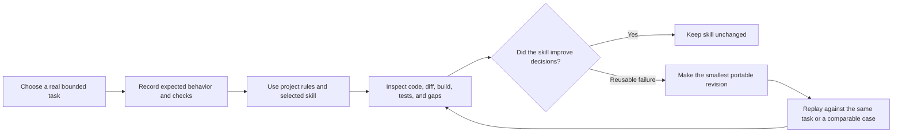

# Android agent skills practice

Status: Active learning workflow

## Purpose

This repository is the practice host for a portable Android skill library under [`.agents/skills/`](../../.agents/skills/). The skills teach coding agents how to discover an unfamiliar Android project, choose a focused workflow, respect local architecture, and verify outcomes. They are not a second copy of project rules.

[`AGENTS.md`](../../AGENTS.md) is the project contract and skill router. [`CLAUDE.md`](../../CLAUDE.md) imports that contract for Claude Code. Agents without automatic skill discovery can follow the linked `SKILL.md` entry points.

## Skill map

| Skill | Practice concern | Representative GJPLab task |
| --- | --- | --- |
| [`android-compose-material3`](../../.agents/skills/android-compose-material3/SKILL.md) | Compose UI, Material 3, accessibility, adaptive layout, previews | Bring the splash presentation into alignment with its requirements |
| [`android-feature-architecture`](../../.agents/skills/android-feature-architecture/SKILL.md) | State ownership, lifecycle, navigation, dependency wiring | Extract testable startup coordination only when coverage requires it |
| [`android-data-concurrency`](../../.agents/skills/android-data-concurrency/SKILL.md) | Repositories, coroutines, Flow, persistence, synchronization | Review `HttpURLConnectionRepository` threading and cancellation |
| [`android-platform-privacy`](../../.agents/skills/android-platform-privacy/SKILL.md) | Permissions, manifests, components, background execution, privacy | Improve notification-permission timing and remove production token logging |
| [`android-quality-build`](../../.agents/skills/android-quality-build/SKILL.md) | Diagnosis, tests, Gradle, CI, performance, release checks | Add deterministic splash race tests and select proportionate verification |

## Practice loop

## Evidence-based refinement

Before using a skill, record the user outcome, source files, expected artifacts, checks, and risks. Evaluate routing, discovery, scope, correctness, verification, portability, and context efficiency from evidence—not confidence or prose style.

Revise a portable skill only for a failure likely to recur across Android projects. Put local facts such as Activity navigation, Koin, Firebase paths, build commands, API levels, and package identifiers in `AGENTS.md`, not a portable skill. Prefer a narrow correction to accumulating universal rules.

## Skill quality checklist

- The folder name and frontmatter `name` match and use lowercase hyphens.
- The description says what the skill does, when it applies, and an important exclusion.
- The entry point contains shared decisions and routes substantial modes to focused references.
- References are linked directly and loaded conditionally.
- Instructions preserve user intent and authorization boundaries.
- Completion criteria are observable and proportional to risk.
- No copied manual, speculative script, placeholder, duplicated project rule, or hidden dependency remains.
- The skill has been exercised on at least one realistic task before expansion.

Record practice outcomes in the issue, pull request, or task that performed the work; do not create a permanent evidence log for every run.
