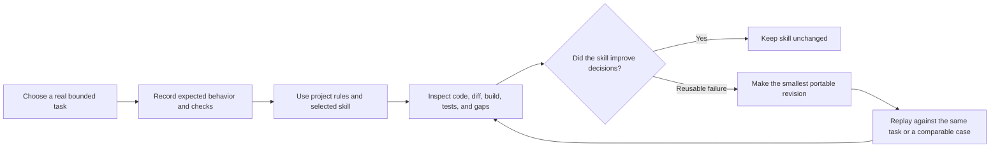

# Android agent skills practice

Status: Active learning workflow

## Purpose

This repository is the practice host for a portable Android skill library under [`.agents/skills/`](../../.agents/skills/). The skills teach coding agents how to discover an unfamiliar Android project, choose a focused workflow, respect local architecture, and verify outcomes. They are not a second copy of project rules.

[`AGENTS.md`](../../AGENTS.md) is the vendor-neutral project contract and skill router. [`CLAUDE.md`](../../CLAUDE.md) imports that contract for Claude Code. Agents without automatic skill discovery can still follow the linked `SKILL.md` entry points.

## Skill map

| Skill | Practice concern | Representative GJPLab task |
| --- | --- | --- |
| [`android-compose-material3`](../../.agents/skills/android-compose-material3/SKILL.md) | Compose UI, Material 3, accessibility, adaptive layout, previews | Bring the splash presentation into alignment with its requirements |
| [`android-feature-architecture`](../../.agents/skills/android-feature-architecture/SKILL.md) | State ownership, lifecycle, navigation, dependency wiring | Extract testable startup coordination only when coverage requires it |
| [`android-data-concurrency`](../../.agents/skills/android-data-concurrency/SKILL.md) | Repositories, coroutines, Flow, persistence, synchronization | Review `HttpURLConnectionRepository` threading and cancellation |
| [`android-platform-privacy`](../../.agents/skills/android-platform-privacy/SKILL.md) | Permissions, manifests, components, background execution, privacy | Improve notification-permission timing and remove production token logging |
| [`android-quality-build`](../../.agents/skills/android-quality-build/SKILL.md) | Diagnosis, tests, Gradle, CI, performance, release checks | Add deterministic splash race tests and select proportionate verification |

## Practice loop



### 1. Choose a representative task

Use a real change with an observable outcome and contained scope. Good practice tasks include failure paths, lifecycle behavior, accessibility, API-level differences, and verification—not only successful code generation.

### 2. Establish a baseline

Before invoking a skill, record:

- user outcome and boundaries;
- relevant project instructions and source files;
- expected artifacts;
- checks that should pass;
- risks or decisions the agent should notice.

This prevents judging a skill by confidence or writing style alone.

### 3. Evaluate behavior

Score the result on evidence:

| Dimension | Passing behavior |
| --- | --- |
| Routing | Selects the minimum relevant skill set and mode |
| Discovery | Reads local instructions, dependencies, nearby code, and tests before deciding |
| Scope | Completes the requested outcome without unrelated migration or dependency changes |
| Correctness | Handles relevant state, lifecycle, failure, concurrency, platform, and security behavior |
| Verification | Runs proportionate checks and reports skipped checks honestly |
| Portability | Uses host-project evidence rather than GJPLab-specific assumptions |
| Context efficiency | Loads only references needed for the selected mode |

### 4. Refine only from reusable evidence

Change a skill when an observed failure would plausibly recur in other Android projects. Prefer one narrow correction to accumulating rules for every local preference.

- Put project-specific facts in `AGENTS.md`, not a portable skill.
- Improve `name` or `description` when routing failed.
- Improve `SKILL.md` when shared discovery or completion behavior failed.
- Improve one reference when a mode-specific decision failed.
- Add a script only when repeated deterministic work justifies executable automation.
- Do not encode a one-off workaround as universal Android architecture.

### 5. Replay and compare

Re-run the original scenario or an equivalent case after revision. Confirm the change improves the target behavior without attracting unrelated tasks or over-constraining valid solutions.

## Applying skills to another project

Copy only skills that serve recurring work in the destination project. Then create or adapt that project's `AGENTS.md` with its actual modules, architecture, dependencies, commands, security boundaries, and local conventions.

Do not copy GJPLab-specific assumptions such as Activity navigation, Koin, Firebase, `minSdk 30`, or package paths into portable skill instructions. The destination repository must remain the source of truth.

## Skill quality checklist

- The folder name and frontmatter `name` match and use lowercase hyphens.
- The description says what the skill does, when it applies, and an important exclusion.
- The entry point contains shared decisions and routes substantial modes to focused references.
- References are linked directly and loaded conditionally.
- Instructions preserve user intent and authorization boundaries.
- Completion criteria are observable and proportional to risk.
- No copied manual, speculative script, placeholder, duplicated project rule, or hidden dependency remains.
- The skill has been exercised on at least one realistic task before expansion.

## Evidence log template

Record practice outcomes in the issue, pull request, or task that performed the work; do not create a permanent log file for every run.

```text
Task:
Selected skill and mode:
Expected decisions:
Checks run:
Observed strengths:
Observed failure:
Portable lesson, if any:
Skill revision:
Replay result:
```
