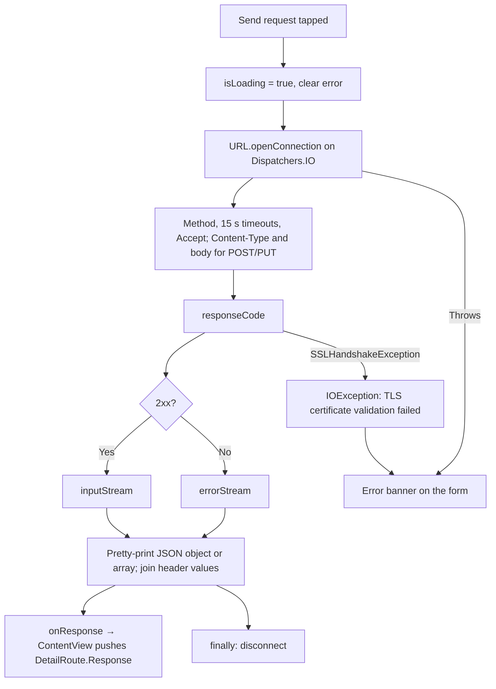

# HttpURLConnection detailed design

Status: Implemented, with known gaps

Requirements: [HttpURLConnection](httpurlconnection_requirement.md)

## Implementation goal

Show the smallest complete `HttpURLConnection` round trip: build a request from user input, send it from a coroutine on `Dispatchers.IO`, and push the status, body, and headers as a response screen inside the feature pane, while keeping connection mechanics out of composables.

## Source map

| Source | Responsibility |
| --- | --- |
| [`HttpURLConnectionScreen.kt`](../../../../../app/src/main/java/com/ganjianping/lab/ak/features/httpclient/httpurlconnection/HttpURLConnectionScreen.kt) | Request form, loading and dismissible error state, send action |
| [`HttpURLConnectionRepository.kt`](../../../../../app/src/main/java/com/ganjianping/lab/ak/features/httpclient/httpurlconnection/HttpURLConnectionRepository.kt) | Connection setup, 15-second timeouts, payload, error stream, JSON formatting, headers, logging, disconnect |
| [`HttpResponseScreen.kt`](../../../../../app/src/main/java/com/ganjianping/lab/ak/features/httpclient/httpurlconnection/HttpResponseScreen.kt) | Status, body, and header presentation |
| [`HttpMethod.kt`](../../../../../app/src/main/java/com/ganjianping/lab/ak/features/httpclient/httpurlconnection/HttpMethod.kt) | Supported methods and which ones carry a payload |
| [`HttpResponse.kt`](../../../../../app/src/main/java/com/ganjianping/lab/ak/features/httpclient/httpurlconnection/HttpResponse.kt) | Status code, body, and header map, carried in `DetailRoute.Response` |
| [`FeatureDestination.kt`](../../../../../app/src/main/java/com/ganjianping/lab/ak/shell/FeatureDestination.kt) | Shows `HttpURLConnectionScreen` for `FeatureRoute.HttpURLConnection` with the injected repository |
| [`ContentView.kt`](../../../../../app/src/main/java/com/ganjianping/lab/ak/shell/ContentView.kt) | Adds `DetailRoute.Response` to `detailPath` and draws `HttpResponseScreen` over the form |
| [`AppModule.kt`](../../../../../app/src/main/java/com/ganjianping/lab/ak/shell/AppModule.kt) | Registers the repository as a Koin singleton; `MainActivity` injects it |
| [`network_security_config.xml`](../../../../../app/src/main/res/xml/network_security_config.xml) | No cleartext for the sample domain; system CAs plus a bundled Sectigo CA |

## Ownership and state

| State | Owner | Lifetime | Meaning |
| --- | --- | --- | --- |
| `method`, `url`, `payload` | `HttpURLConnectionScreen` (`rememberSaveable`) | Feature pane, survives rotation | Current request input |
| `isLoading` | `HttpURLConnectionScreen` (`remember`) | Feature pane | A request is in flight |
| `errorMessage` | `HttpURLConnectionScreen` (`remember`) | Feature pane | Dismissible error banner, cleared on send or edit |
| `HttpResponse` | `ContentView` `detailPath` | Until Back, a topic change, or rotation | Completed response shown by `HttpResponseScreen` |

The screen does not own navigation. It reports a completed response through `onResponse`, and `ContentView` pushes `DetailRoute.Response`, unless the user has already selected another topic. The response is drawn over the form, so the form keeps its input while the response is open. The send coroutine runs in `rememberCoroutineScope()`, so leaving the topic cancels it; the blocking connection call itself finishes on the IO thread and its result is dropped.

## Request flow

## Privacy and security

- Logs contain only the method, status code, body length, and exception type. URLs, payloads, bodies, and headers are never logged.
- `network_security_config.xml` forbids cleartext for `ganjianping.com` and trusts the system CAs plus a bundled Sectigo DV R36 CA for that domain only.
- The default URL calls the author's public API; the lab sends no credentials.

## Known gaps

| Gap | Effect | Suggested fix |
| --- | --- | --- |
| The pushed response is not saved | Rotating the device closes the response screen (the form input is kept) | Make `HttpResponse` `Parcelable` and save `detailPath` |
| Status colors are raw hex values | Not theme roles; poor contrast in dark theme | Use theme roles (`error` and a success role) |
| Bundled CA for the sample domain | Custom trust behavior for one endpoint, which the iOS lab avoids | Remove once the server serves a chain trusted by the system store |
| Payload is not validated as JSON | Invalid JSON is sent as-is | Validate before sending, or label the field as raw text |
| No automated tests | URL handling, error streams, and formatting are unguarded | Unit-test the repository against a local `MockWebServer`-style stub |

## Verification

- Build and test with the commands in [application architecture](../../../../architecture/application.md#build-and-verification).
- Previews: request form (GET; POST with an error) and response (success; error), each in light and dark.
- Automated: none.
- Manual: HUC-AC-01 to HUC-AC-07 on an emulator, including airplane mode for HUC-AC-06; check dark theme, the largest font size, and a large window where the form sits beside the catalogue.
