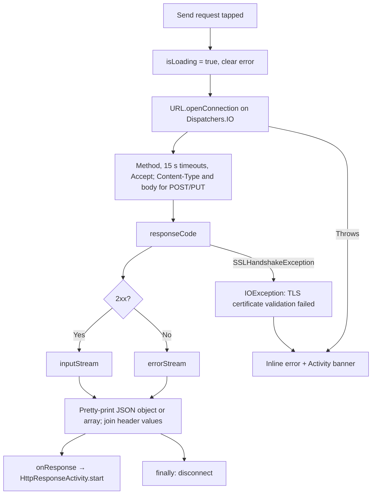

# HttpURLConnection detailed design

Status: Implemented, with known gaps

Requirements: [HttpURLConnection](httpurlconnection_requirement.md)

## Implementation goal

Show the smallest complete `HttpURLConnection` round trip: build a request from user input, send it from a coroutine on `Dispatchers.IO`, and present the status, body, and headers on a second Activity, while keeping connection mechanics out of composables.

## Source map

| Source | Responsibility |
| --- | --- |
| [`HttpURLConnectionActivity.kt`](../../../../../app/src/main/java/com/ganjianping/lab/ak/features/httpclient/httpurlconnection/HttpURLConnectionActivity.kt) | Injects the repository, hosts the screen and call blocking, shows the error banner, opens the response |
| [`HttpURLConnectionScreen.kt`](../../../../../app/src/main/java/com/ganjianping/lab/ak/features/httpclient/httpurlconnection/HttpURLConnectionScreen.kt) | Request form, loading and inline error state, send action; also `HttpErrorBanner` |
| [`HttpURLConnectionRepository.kt`](../../../../../app/src/main/java/com/ganjianping/lab/ak/features/httpclient/httpurlconnection/HttpURLConnectionRepository.kt) | Connection setup, 15-second timeouts, payload, error stream, JSON formatting, headers, logging, disconnect |
| [`HttpResponseActivity.kt`](../../../../../app/src/main/java/com/ganjianping/lab/ak/features/httpclient/httpurlconnection/HttpResponseActivity.kt) | Receives the response as Intent extras and hosts the response screen |
| [`HttpResponseScreen.kt`](../../../../../app/src/main/java/com/ganjianping/lab/ak/features/httpclient/httpurlconnection/HttpResponseScreen.kt) | Status, body, and header presentation |
| [`HttpMethod.kt`](../../../../../app/src/main/java/com/ganjianping/lab/ak/features/httpclient/httpurlconnection/HttpMethod.kt) | Supported methods and which ones carry a payload |
| [`HttpResponse.kt`](../../../../../app/src/main/java/com/ganjianping/lab/ak/features/httpclient/httpurlconnection/HttpResponse.kt) | Status code, body, and header map |
| [`AppModule.kt`](../../../../../app/src/main/java/com/ganjianping/lab/ak/shell/AppModule.kt) | Registers the repository as a Koin singleton |
| [`network_security_config.xml`](../../../../../app/src/main/res/xml/network_security_config.xml) | No cleartext for the sample domain; system CAs plus a bundled Sectigo CA |

## Ownership and state

| State | Owner | Lifetime | Meaning |
| --- | --- | --- | --- |
| `method`, `url`, `payload` | `HttpURLConnectionScreen` (`remember`) | Composition | Current request input |
| `isLoading` | `HttpURLConnectionScreen` (`remember`) | Composition | A request is in flight |
| `errorMessage` | `HttpURLConnectionScreen` (`remember`) | Composition | Inline error, cleared on send or edit |
| `activityErrorMessage` | `HttpURLConnectionActivity` (`mutableStateOf`) | Activity | Dismissible banner over the screen |
| Response | `HttpResponseActivity` Intent extras | Response Activity | Status, body, and headers joined into one string |

The send coroutine runs in `rememberCoroutineScope()`, so leaving the screen cancels the coroutine; the blocking connection call itself finishes on the IO thread and its result is dropped.

## Request flow

## Privacy and security

- Logs contain only the method, status code, body length, and exception type. URLs, payloads, bodies, and headers are never logged.
- `network_security_config.xml` forbids cleartext for `ganjianping.com` and trusts the system CAs plus a bundled Sectigo DV R36 CA for that domain only.
- The default URL calls the author's public API; the lab sends no credentials.

## Known gaps

| Gap | Effect | Suggested fix |
| --- | --- | --- |
| Error is shown twice | The inline message and the Activity banner show the same text | Keep one: the dismissible banner (matches iOS) |
| Back uses text buttons ("‹  Main", "‹  Request") | Inconsistent with Material navigation; "Main" is no longer the previous screen | Use a `TopAppBar` with a navigation icon |
| Response passed as Intent extras | Headers are flattened to one string; very large bodies can exceed the Binder transaction limit and crash | Pass a small value, or keep the response in memory and show it in the same Activity |
| Status colors are raw hex values | Not theme roles; poor contrast in dark theme | Use theme roles (`error` and a success role) |
| Bundled CA for the sample domain | Custom trust behavior for one endpoint, which the iOS lab avoids | Remove once the server serves a chain trusted by the system store |
| Payload is not validated as JSON | Invalid JSON is sent as-is | Validate before sending, or label the field as raw text |
| No previews | The screens are not checked in light and dark | Add light/dark previews with sample state |
| No automated tests | URL handling, error streams, and formatting are unguarded | Unit-test the repository against a local `MockWebServer`-style stub |

## Verification

- Build and test with the commands in [application architecture](../../../../architecture/application.md#build-and-verification).
- Automated: none.
- Manual: HUC-AC-01 to HUC-AC-07 on an emulator, including airplane mode for HUC-AC-06; check dark theme and the largest font size.
