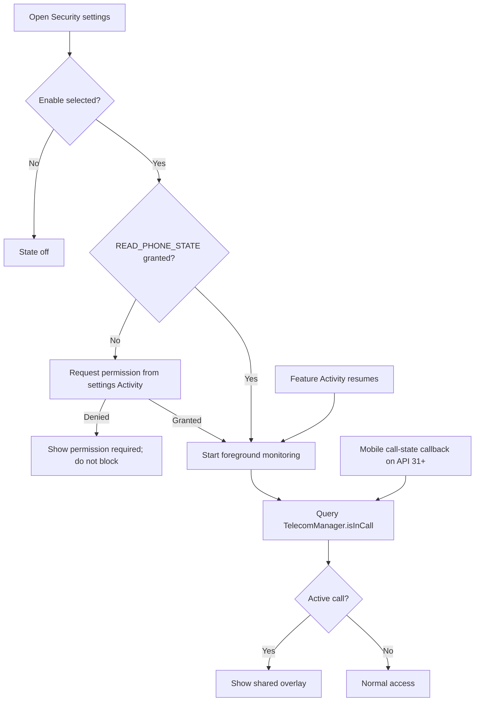

# Block App During Calls detailed design

Status: Partial implementation

Requirements: [Block App During Calls](blockappduringcalls_requirement.md)

## Implementation goal

Prevent interaction with GJPLab while Android reports a system-exposed active call, while keeping the app usable when the setting is off, permission is denied, a device cannot provide call state, or a provider does not expose its call through Telecom.

## Source map

| Source | Responsibility |
| --- | --- |
| [`BlockAppDuringCallsController.kt`](../../../../../app/src/main/java/com/ganjianping/lab/ak/features/security/blockappduringcalls/BlockAppDuringCallsController.kt) | Persisted preference, permission-aware Telecom query, foreground mobile-call callback, and simulated state |
| [`CallBlockingHost.kt`](../../../../../app/src/main/java/com/ganjianping/lab/ak/features/security/blockappduringcalls/CallBlockingHost.kt) | Shared state collection and app-owned blocking overlay |
| [`BlockAppDuringCallsActivity.kt`](../../../../../app/src/main/java/com/ganjianping/lab/ak/features/security/blockappduringcalls/BlockAppDuringCallsActivity.kt) | Settings route, explicit runtime permission, and foreground lifecycle ownership |
| [`BlockAppDuringCallsScreen.kt`](../../../../../app/src/main/java/com/ganjianping/lab/ak/features/security/blockappduringcalls/BlockAppDuringCallsScreen.kt) | Settings, status, test path, and platform limitation UI |
| [`AppModule.kt`](../../../../../app/src/main/java/com/ganjianping/lab/ak/shell/AppModule.kt) | Application-scoped Koin controller registration |
| [`FeatureCatalogActivity.kt`](../../../../../app/src/main/java/com/ganjianping/lab/ak/shell/navigation/FeatureCatalogActivity.kt) | Security catalogue route and Activity launch |
| [`AndroidManifest.xml`](../../../../../app/src/main/AndroidManifest.xml) | `READ_PHONE_STATE` declaration and non-exported settings Activity |

## Ownership and state

`BlockAppDuringCallsController` is a Koin singleton. It owns the `SharedPreferences` Boolean and a `StateFlow<CallBlockingState>`; each Activity starts monitoring on resume, stops the mobile callback on pause, and renders `CallBlockingHost` at its Compose root.

| State | Owner | Persistence | Meaning |
| --- | --- | --- | --- |
| `isEnabled` | Controller | `SharedPreferences` | User intent; defaults off |
| `availability` | Controller | None | Off, permission required, unavailable, or monitoring active |
| `hasActiveCall` | Controller | None | Latest aggregate `TelecomManager.isInCall()` value |
| `isTestCallActive` | Controller | None | Developer verification state |
| `isBlocking` | Derived state | None | Enabled, monitoring active, and either real or simulated call active |

## Runtime flow

The controller registers `TelephonyCallback.CallStateListener` only while an Activity is foregrounded and only on API 31+. Callback updates re-query `TelecomManager.isInCall()` so the UI uses a single aggregate decision. The callback is a mobile-telephony signal, not a third-party VoIP guarantee.

## App-wide overlay and test path

Every current Activity hosts `CallBlockingHost`, which places the overlay above its destination content. A real call has no bypass. The simulated-call path reaches the same derived `isBlocking` condition and presents a test-only end action in the overlay so the verification flow can complete without restarting the app.

The controller stores only the Boolean preference. It never receives or records phone numbers, call handles, contacts, call metadata, or provider names.

## Limitations and safeguards

- `READ_PHONE_STATE` is requested only after the user enables this feature. Denial or revocation leaves the app usable and reports the requirement.
- The implementation never requests the default dialer role and declares no `InCallService`, background service, accessibility service, or notification listener.
- `TelecomManager.isInCall()` reports only Android Telecom calls. Provider support, OEM behavior, and hardware capability can make coverage incomplete.
- A `SecurityException` is treated as unavailable; the feature does not fall back to inference from other personal data or system signals.

## Verification

- JVM: [`CallBlockingStateTest`](../../../../../app/src/test/java/com/ganjianping/lab/ak/features/security/blockappduringcalls/CallBlockingStateTest.kt) verifies real and simulated call blocking decisions.
- Build: `./gradlew --no-daemon :app:compileDebugKotlin :app:testDebugUnitTest`.
- Device: grant, deny, and revoke `READ_PHONE_STATE`; verify simulated blocking, Activity navigation, foreground refresh, a system-exposed call, and light/dark or enlarged-text presentation.
- A physical device is required for real call and permission behavior; automated tests must not rely on a live call or third-party app.
