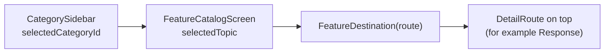

# Category sidebar detailed design

Status: Implemented, with known gaps

Requirements: [Category sidebar](sidebar_requirement.md)

## Implementation goal

Use one root composable, `ContentView`, for every window size: three panes on large windows, two on expanded ones, and one stack on narrow ones, all driven by the same selection state ([decision 0005](../../../decisions/0005-adaptive-pane-navigation.md)).

## Source map

| Source | Responsibility |
| --- | --- |
| [`ContentView.kt`](../../../../app/src/main/java/com/ganjianping/lab/ak/shell/ContentView.kt) | Owns `selectedCategoryId`, `selectedTopic`, and `detailPath`; picks the layout; handles Back; pushes the HTTP response |
| [`NavigationPane.kt`](../../../../app/src/main/java/com/ganjianping/lab/ak/shell/navigation/NavigationPane.kt) | `paneLayout` breakpoints, pane widths, `NavigationPane` (top app bar and width-limited content), and `NavigationPlaceholder` |
| [`CategorySidebar.kt`](../../../../app/src/main/java/com/ganjianping/lab/ak/shell/navigation/CategorySidebar.kt) | Category list and rows |
| [`LabListCard.kt`](../../../../app/src/main/java/com/ganjianping/lab/ak/common/theme/LabListCard.kt) | The bordered card used by every sidebar and catalogue row |
| [`FeatureCatalogScreen.kt`](../../../../app/src/main/java/com/ganjianping/lab/ak/shell/navigation/FeatureCatalogScreen.kt) | Catalogue pane: topic list with selection |
| [`FeatureDestination.kt`](../../../../app/src/main/java/com/ganjianping/lab/ak/shell/FeatureDestination.kt) | Maps a `FeatureRoute` to its screen; `FeatureDependencies` |
| [`FeatureRoute.kt`](../../../../app/src/main/java/com/ganjianping/lab/ak/shell/navigation/FeatureRoute.kt) | `FeatureRoute` (topic selection) and `DetailRoute` (screens pushed inside the feature pane) |
| [`NavigationMenu.kt`](../../../../app/src/main/java/com/ganjianping/lab/ak/shell/navigation/NavigationMenu.kt) | Category order, text, icons, and topics |
| [`MainActivity.kt`](../../../../app/src/main/java/com/ganjianping/lab/ak/shell/MainActivity.kt) | Hosts `ContentView`, injects `FeatureDependencies`, and owns call monitoring |

## Navigation model

| State | Type | Owner | Survives rotation | Reset when |
| --- | --- | --- | --- | --- |
| `selectedCategoryId` | `String?` | `ContentView` (`rememberSaveable`) | Yes | Back with no topic selected |
| `selectedTopic` | `FeatureRoute?` | `ContentView` (`rememberSaveable`) | Yes | The category changes, or Back with no pushed screen |
| `detailPath` | `List<DetailRoute>` | `ContentView` (`mutableStateListOf`) | No | The topic changes, or Back |

`paneLayout(maxWidth)` chooses how the same state is shown:

| Layout | Window width | Panes |
| --- | --- | --- |
| `Three` | ≥ 1200dp | Sidebar (320dp) │ catalogue or "Choose a category" (360dp) │ feature or "Choose a topic" |
| `Two` | 840–1199dp | Sidebar, or catalogue with a back arrow (360dp) │ feature or prompt |
| `Single` | < 840dp | Feature if a topic is selected, else catalogue if a category is selected, else sidebar; each below the sidebar has a back arrow |

`BackHandler` is enabled while a category is selected and undoes one step: pop `detailPath`, else clear the topic, else clear the category. With nothing selected, Back reaches the Activity and leaves the app.

A pushed `DetailRoute` is drawn in its own `NavigationPane` over the feature, so the feature stays composed and keeps its state. The HTTP response is pushed only if the HttpURLConnection topic is still selected when the request finishes.

## Rows

Each sidebar row is a `LabListCard`: a `surface` card with 18dp corners, a 0.5dp `outlineVariant` border (1dp `primary` when selected), 16dp padding, and 12dp between cards. It shows the category icon in a 44dp `primaryContainer` tile with 12dp corners, the title in `titleMedium` semibold, and the summary in `bodyMedium` `onSurfaceVariant`. The whole card is one clickable element with the click label "Open the <category> catalogue". Panes use the `background` canvas, and their content is limited to 720dp and centred.

## Replaced design

This replaces the card-grid dashboard (2, 3, or 5 columns by width) in `MainActivity` that opened a separate `FeatureCatalogActivity`, which in turn opened one Activity per feature. Wide windows showed only one level at a time, and card text was cut off at large font sizes.

## Known gaps

| Gap | Effect | Suggested fix |
| --- | --- | --- |
| `detailPath` is not saved | Rotating or resizing closes a pushed response | Make `HttpResponse` `Parcelable` and save the path, or keep a small ID in the path |
| No pane transitions or predictive-back animation | Level changes on phones are instant | Add `AnimatedContent`, or adopt Material 3 adaptive with a new decision |
| Scroll position of a pane is lost when it leaves the stack | Returning to the catalogue on a phone starts at the top | Hoist `LazyListState` per pane, or use a `SaveableStateHolder` |
| No search across topics | Finding a topic means browsing categories | Add a search field over all available topics |
| No UI test | Pane switching and Back are unguarded | Add Compose UI tests at phone and tablet widths |

## Verification

- Previews: `ContentView` (phone and tablet, light and dark), `CategorySidebar` (light and dark).
- Unit tests: `NavigationPaneTest` (breakpoints and pane widths), `NavigationMenuTest` (routes and topic lookup).
- Manual: SDB-AC-01 to SDB-AC-06 on a phone emulator and at large and expanded widths (for example `adb shell wm size 2856x1280` with densities 360 and 480), with TalkBack and the largest font size.
