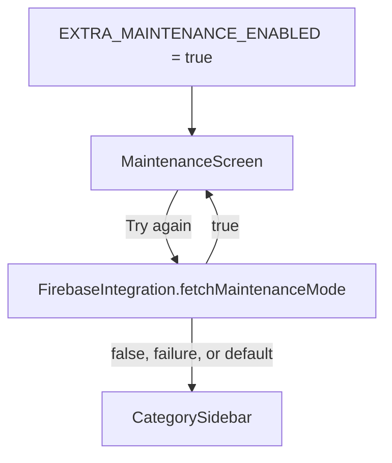

# Maintenance detailed design

Status: Implemented, with known gaps

Requirements: [Maintenance](maintenance_requirement.md)

## Implementation goal

Show a blocking maintenance message when the remote flag is enabled, and let the user re-check the flag from `MainActivity` without returning to the splash.

## Source map

| Source | Responsibility |
| --- | --- |
| [`MaintenanceScreen.kt`](../../../../app/src/main/java/com/ganjianping/lab/ak/shell/startup/MaintenanceScreen.kt) | Stateless presentation; reports taps through `onRetry` |
| [`MainActivity.kt`](../../../../app/src/main/java/com/ganjianping/lab/ak/shell/MainActivity.kt) | Reads `EXTRA_MAINTENANCE_ENABLED`, owns `maintenanceEnabled`, chooses the screen, and runs `loadRemoteConfig()` on retry |
| [`SplashActivity.kt`](../../../../app/src/main/java/com/ganjianping/lab/ak/shell/startup/SplashActivity.kt) | Resolves the startup value and passes it as the Intent extra |
| [`FirebaseIntegration.kt`](../../../../app/src/main/java/com/ganjianping/lab/ak/features/integration/firebase/FirebaseIntegration.kt) | `fetchMaintenanceMode`: fetch-and-activate, then report the current Boolean; Remote Config default and fetch interval |

## Ownership and flow

`MaintenanceScreen` holds no state. `MainActivity` keeps `maintenanceEnabled` in a Compose `mutableStateOf` field and renders `MaintenanceScreen` instead of `CategorySidebar` while it is `true`. There is no Activity for maintenance, so Back simply leaves the app.

Unlike startup, retry has no connectivity precheck and no 5-second timeout; it waits for the Firebase task to complete. A failed fetch reports the last activated value or the `false` default.

## Known gaps

| Gap | Effect | Suggested fix |
| --- | --- | --- |
| Retry has no timeout | A hanging fetch leaves the user on maintenance with no feedback | Reuse the startup timeout (`AppConfig.REMOTE_CONFIG_TIMEOUT_MS`) |
| No progress state during retry | Nothing changes on screen after tapping until the fetch completes | Show a progress indicator and disable the button while retrying |
| Repeated taps start overlapping fetches | The last callback to finish decides the screen | Ignore taps while a retry is running |
| `maintenanceEnabled` is not saved | Activity recreation (for example rotation) re-reads the original Intent extra, which can bring maintenance back after a successful retry | Save it with `onSaveInstanceState` or update the Intent extra after retry |
| No maintenance icon | Differs from the iOS screen | Add a decorative icon with `contentDescription = null` |
| Release fetch interval is one hour | A cached `true` can keep users blocked after maintenance ends | Use a shorter interval for this key, or Remote Config real-time updates |
| No automated tests | Retry and fail-open behavior are unguarded | Test through a startup coordinator with an injected loader (see the splash detailed design) |

## Verification

- Previews: `MaintenanceScreen` light and dark.
- Manual, debug build: set `gjp_lab_maintenance_enabled` to `true` in the Firebase console, launch, confirm MNT-AC-01; set it to `false`, tap **Try again**, confirm MNT-AC-02. Repeat in airplane mode for MNT-AC-04.
- Check dark theme and the largest font size (MNT-AC-05).
